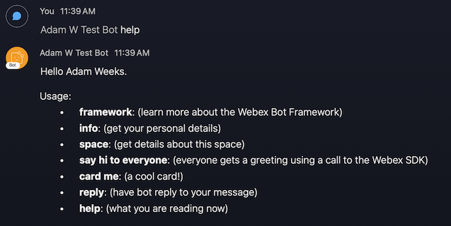

# Webex-Bot-Starter

### Starter kit and template for a simple Webex bot

_For a more detailed walkthorugh, see the [companion blog post here](https://developer.webex.com/blog/from-zero-to-webex-teams-chatbot-in-15-minutes)_

This is a very simple Webex node.JS bot application that serves as a template to be further extended. It features the [webex-node-bot-framework](https://github.com/WebexCommunity/webex-node-bot-framework) that simplifies development for Webex bots by abstracting away some of the complexity of the API calls and registering for events.

Here is the bot in action:

## Prerequisites:

- [ ] node.js (minimum supported v8.0.0 & npm 2.14.12 and up)

- [ ] [Sign up for Webex Developer Account](https://developer.webex.com/signup)

---

## Steps to get the bot working

1. Create a Webex bot (save the API access token and username): https://developer.webex.com/my-apps/new/bot

1. Copy the `.env.local` file to a file called `.env`

1. Edit `.env` with the following values:

- BOTTOKEN - Set this to the token for your bot that you got in step 1

1. Turn on your bot server with `npm start`

1. Create a space in Webex

1. Add the bot (by its username) to the space in Webex

1. @ mention your bot with `help` to get your first response: `@mybotname help`

## Optional: Webhooks

The [webex-node-bot-framework](https://github.com/WebexCommunity/webex-node-bot-framework) supports WebSockets by default. If you would prefer your bot to operate via [Webhooks](https://developer.webex.com/docs/api/guides/webhooks), use these steps.

1. Sign up for nGrok, then connect and start it on your machine (save the port number and public web address): https://ngrok.com/download

1. After installing ngrok, run it on your local machine to get a public ip address, eg `ngrok http 3000 --region=eu`

1. Copy the ip address displayed in the ngrok window, ie: : https://1234.eu.ngrok.io

1. Edit `.env` with the following values:

- PORT - Set this to the port you set when you started ngrok
- WEBHOOKURL - Set this to the ip address that you copied
