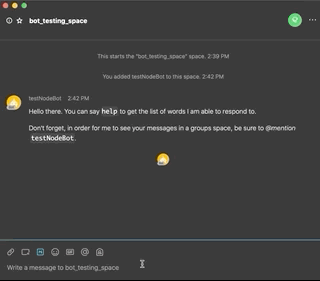

# Webex-Bot-Starter

### Starter kit and template for a simple Webex Teams bot

*For a more detailed walkthorugh, see the (forthcoming) companion blog post here: https://example.com/nothing_here_yet*




## Prerequisites:

- [ ] node.js (minimum supported v8.0.0 & npm 2.14.12 and up)

- [ ] Sign up for Webex Teams (logged in with your web browser)


----

## Steps to get the bot working

1. Create a Webex Teams bot (save the API access token and username): https://developer.webex.com/my-apps/new/bot

2. Sign up for nGrok, then connect and start it on your machine (save the port number and public web address): https://ngrok.com/download
 
3. Add the nGrok address, port number and bot access token to the `config-template.json` file

4. Re-name the  `config-template.json`  file as  `config.json`

5. Turn on your bot server with ```npm start```

6. Create a space in Webex Teams

7. Add the bot (by its username) to the space in Webex Teams