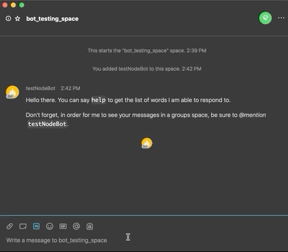

# Webex-Bot-Starter

### Starter kit and template for a simple Webex bot

_For a more detailed walkthorugh, see the [companion blog post here](https://developer.webex.com/blog/from-zero-to-webex-teams-chatbot-in-15-minutes)_

This is a very simple Webex node.JS bot application that serves as a template to be further extended. It features the [webex-node-bot-framework](https://github.com/webex/webex-bot-node-framework) that simplifies development for Webex bots by abstracting away some of the complexity of the API calls and registering for events. Some parts of the app are taken from on the old [sparkbotstarter](https://github.com/valgaze/sparkbotstarter) template created by Victor Algaze.

Here is the bot in action:

git

## Prerequisites:

- [ ] node.js (minimum supported v8.0.0 & npm 2.14.12 and up)

- [ ] [Sign up for Webex Developer Account](https://developer.webex.com/signup)

---

## Steps to get the bot working

1. Create a Webex bot (save the API access token and username): https://developer.webex.com/my-apps/new/bot

2. Sign up for nGrok, then connect and start it on your machine (save the port number and public web address): https://ngrok.com/download

3. After installing ngrok, run it on your local machine to get a public ip address, eg `ngrok http 3000 --region=eu`

4. Copy the ip address displayed in the ngrok window, ie: : https://1234.eu.ngrok.io

5. Copy the `.env.local` file to a file called `.env`

6. Edit `.env` with the following values:

- BOTTOKEN - Set this to the token for your bot that you got in step 1
- PORT - Set this to the port you set when you started ngrok in step 3 (ie: 3000)
- WEBHOOKURL - Set this to the ip address that you copied in step 4

5. Turn on your bot server with `npm start`

6. Create a space in Webex

7. Add the bot (by its username) to the space in Webex
