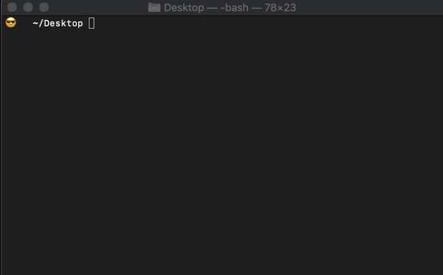

## Quickstart

Note: The steps below assume you have a WebEx account and possess account permissions to create **[WebEx bots](https://developer.webex.com/my-apps/new/bot)**

Security: See **[here](#ngrok)** for security considerations when using a tunneling tool like ngrok

## 1. Create a WebEx bot (save the token)

* Create a bot here: https://developer.webex.com/my-apps/new/bot

* Follow the steps and make a note of the token (you'll use it in a moment)


## 2. Clone & setup repo

In a terminal window run the following:

```
git clone https://github.com/WebexSamples/webex-bot-starter
cd webex-bot-starter
npm run setup
```

## 3. Save bot token to config.json

Take the token from step 2 & save it under the ```token``` field in **[config.json](./config.json)**


## 4. Setup a tunnel & save URL to config.json

Open a new terminal instance and run the following command, make a note of the URL & save it under the ```webhookUrl``` field in **[config.json](./config.json)**

```sh
cd webex-bot-starter
npm run tunnel
```


## 5. Boot the server

In a new terminal window, launch the server in live-reload mode:

```sh
cd webex-bot-starter
npm run dev
```



Note: If you make an change, the server will reload automatically. 

To start the server without reloading on changes use:

```sh
npm run start:noinstall
```

## 6. Add the bot to a WebEx Teams Space

* Find or create a space in Webex Teams

* Add the bot by its username the space

* @ mention the bot and say "help"


Now that your bot infrastructure is up & running, you can make changes on your local machine here and see them reflected in your agent's responses.

Note that this session will expire after 8 hours-- to get more serious about your bot and its features, see the resources below

* https://developer.webex.com/docs/bots

* https://developer.webex.com/blog/from-zero-to-webex-teams-chatbot-in-15-minutes

* LEARNING LABS: https://developer.cisco.com/learning/lab/collab-spark-botkit/step/1

## 7a. Inspect Network Requests

Open **[http://localhost:4040](http://localhost:4040)** to use a traffic inspector from nGrok to see what WebEx sends to your webhook. You can also intercept & "replay" requests and see the webhook system dispatch data to the bot.


### nGrok

See **[here](./docs/ngrok.md)** for considerations you should make before using a tool like ngrok.

If you are having any trouble, you can change the "ngrok" configuration fields in the main **[config.json file](config.json)**

```json
"ngrok": {
  "region":"us",
  "bind_tls":true
}
```
<details><summary>(Expand for details on nGrok configuration options)</summary>
<p>


There are lots of options you can use to configure nGrok, see here for details: **https://ngrok.com/docs** 

Enterprise/Pro features available here: https://ngrok.com/pricing

|  **Item** | Description |
| --- | --- |
|  **proto** | tunnel protocol name, one of http, tcp, tls |
|  **addr** | forward traffic to this local port number or network address |
|  **inspect** | enable http request inspection |
|  **auth** | HTTP basic authentication credentials to enforce on tunneled requests |
|  **host_header** | Rewrite the HTTP Host header to this value, or preserve to leave it unchanged |
|  **bind_tls** | bind an HTTPS or HTTP endpoint or both true, false, or both |
|  **subdomain** | subdomain name to request. If unspecified, uses the tunnel name |
|  **hostname** | hostname to request (requires reserved name and DNS CNAME) |
|  **crt** | PEM TLS certificate at this path to terminate TLS traffic before forwarding locally |
|  **key** | PEM TLS private key at this path to terminate TLS traffic before forwarding locally |
|  **client_cas** | PEM TLS certificate authority at this path will verify incoming TLS client connection certificates. |
|  **remote_addr** | bind the remote TCP port on the given address |
|  **metadata** | arbitrary user-defined metadata that will appear in the ngrok service API when listing tunnels |

|  Region | Code |
| --- | --- |
|  **ap** | Asia/Pacific |
|  **au** | Australia |
|  **eu** | Europe |
|  **in** | India |
|  **jp** | Japan |
|  **sa** | South America |
|  **us** | United States (default) |
</p>
</details>
